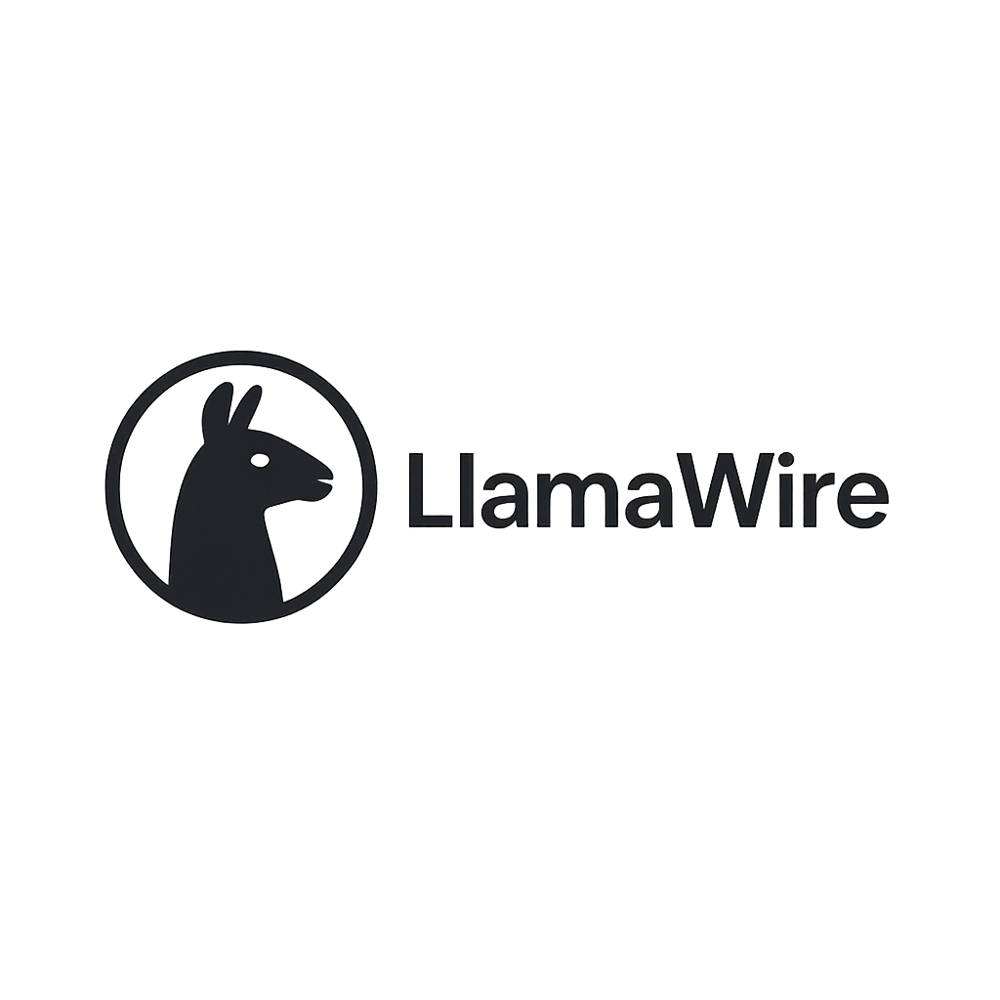

# LlamaWire 🦙⚡️

[](https://hub.docker.com/r/groos12/llama-wire)

<p align="center"></p>

**LlamaWire is a lightweight chat client designed for benchmarking the performance of Ollama models directly on the hardware where Ollama is running.** Think of it like a diagnostic console for your Ollama server, providing real-time feedback (like Tokens Per Second) to help you understand and optimize hardware efficiency, especially crucial for rented infrastructure. While ideal for running alongside Ollama, it can also serve as a simple chat client connecting to any accessible Ollama instance or cluster.

## Hardware Benchmarking & Optimization

The main purpose of LlamaWire is to provide a simple tool to:
*   Measure the inference speed (Tokens Per Second) of different Ollama models in real-time, directly on the host system.
*   Compare performance across various models or configurations on a specific hardware setup.
*   Help optimize resource usage, particularly when using rented GPUs or servers, by providing immediate performance feedback.
*   Log performance history for different queries and models for analysis.

## Features

*   **Real-time TPS:** Displays a moving average of Tokens Per Second (TPS) during model response generation.
*   **Configurable Ollama Endpoint:** Connect to any accessible Ollama instance (local, remote, Dockerized) via its URL.
*   **Dynamic Model Selection:** Fetches and allows selection from models available on the target Ollama instance.
*   **Performance History:** Logs query, model, TPS, timestamp, and Ollama URL to browser `localStorage` for later review.
*   **Simple Chat Interface:** Basic chat functionality for interacting with the models to generate performance data.
*   **Easy Docker Deployment:** Run instantly using the multi-platform Docker image.

## Prerequisites

*   [Node.js](https://nodejs.org/) (v18 or later recommended)
*   [npm](https://www.npmjs.com/), [yarn](https://yarnpkg.com/), or [pnpm](https://pnpm.io/)
*   A running [Ollama](https://ollama.com/) instance with a downloaded model (e.g., `phi4`).
    *   Make sure the Ollama API is accessible (usually at `http://localhost:11434`).

## Setup & Running

1.  **Clone the repository (if you haven't already):**
    ```bash
    git clone <your-repository-url>
    cd LlamaWire
    ```

2.  **Install dependencies:**
    ```bash
    npm install
    # or
    yarn install
    # or
    pnpm install
    ```

3.  **Ensure Ollama is Running:**
    Start your Ollama application and make sure the model you want to use (specified in `src/App.jsx`, currently `phi4`) is available.

4.  **Start the development server:**
    ```bash
    npm run dev
    # or
    yarn dev
    # or
    pnpm dev
    ```
    This will typically start the application on `http://localhost:5173` (or another port specified by your Vite config).

5.  **Open your browser** and navigate to the provided local URL. Start chatting!

## Running with Docker (Recommended)

If you have Docker installed, you can run LlamaWire directly from the pre-built image available on Docker Hub. This is the easiest way to get started without needing Node.js installed locally.

1.  **Ensure Ollama is Running:**
    Make sure your Ollama instance is running and accessible from your network. If you are running Docker on the same machine as Ollama, note the following:
    *   **Linux:** Use the host IP address or `host.docker.internal` if configured.
    *   **macOS/Windows (Docker Desktop):** You can often use the special DNS name `host.docker.internal` to refer to your host machine from within the container. For example, your Ollama endpoint might be `http://host.docker.internal:11434`.
    *   You will need to configure the Ollama URL within the LlamaWire application once it's running (this feature needs to be added). Currently, it defaults to `http://localhost:11434`, which *will not work* from inside the container unless Ollama itself is also running in a container on the same Docker network.

2.  **Pull the latest image:**
    ```bash
    docker pull groos12/llama-wire:latest
    ```

3.  **Run the container:**
    ```bash
    # Map port 8080 on your machine to port 80 in the container
    docker run --rm -p 8080:80 groos12/llama-wire:latest
    ```
    *   `--rm`: Automatically removes the container when it stops.
    *   `-p 8080:80`: Maps port `8080` on your host to port `80` (where Nginx runs) in the container. You can change `8080` if that port is busy (e.g., `-p 3001:80`).

4.  **Open your browser** and navigate to `http://localhost:8080` (or the host port you chose).

## Configuration

*   The Ollama model used can be changed in `src/App.jsx` within the `fetch` call (`model: "phi4"`).
*   The Ollama API endpoint is currently hardcoded to `http://localhost:11434/api/chat` in `src/App.jsx`.
    *   **Docker Note:** When running LlamaWire in Docker, `localhost` refers to the *container itself*, not your host machine. You need to use the appropriate network address for your Ollama instance (e.g., `http://host.docker.internal:11434` for Docker Desktop, or the host's IP address). An upcoming feature will allow configuring this URL in the UI.

## LlamaWire

A modern, sleek interface for chatting with Ollama models.

### Features

- Clean, intuitive UI with a responsive design
- Support for all Ollama models
- Markdown rendering in chat responses
- Code syntax highlighting and formatting
- Tokens per second (TPS) measurement
- Easy configuration with minimal setup

### Docker

#### Running from Docker Hub

```bash
docker run -p 3000:80 groos12/llama-wire:latest
```

The Docker image supports both ARM64 (e.g., Apple Silicon M1/M2) and AMD64 architectures automatically.

Then navigate to http://localhost:3000 in your browser.

#### Building locally

```bash
# Build the Docker image
docker build -t llama-wire .

# Run the container
docker run -p 3000:80 llama-wire
```

### Development

```bash
# Install dependencies
npm install

# Start the development server
npm run dev
```

### CI/CD Setup

This project uses GitHub Actions to automatically build and push the Docker image to Docker Hub when changes are merged to the main branch.

To set up the CI/CD pipeline:

1. Go to your GitHub repository settings
2. Navigate to "Secrets and variables" → "Actions"
3. Add the following secrets:
   - `DOCKERHUB_USERNAME`: Your Docker Hub username
   - `DOCKERHUB_TOKEN`: A Docker Hub personal access token (create one at https://hub.docker.com/settings/security)

Once these secrets are set, the workflow will automatically build and push the image to Docker Hub whenever you merge to the main branch.

### Usage with Ollama

LlamaWire is designed to work with [Ollama](https://ollama.ai/). Make sure you have Ollama running locally or on a server accessible from your network.

1. Start the Ollama server
2. In LlamaWire, set the Ollama URL (default is http://localhost:11434)
3. Select a model from the dropdown
4. Start chatting!
